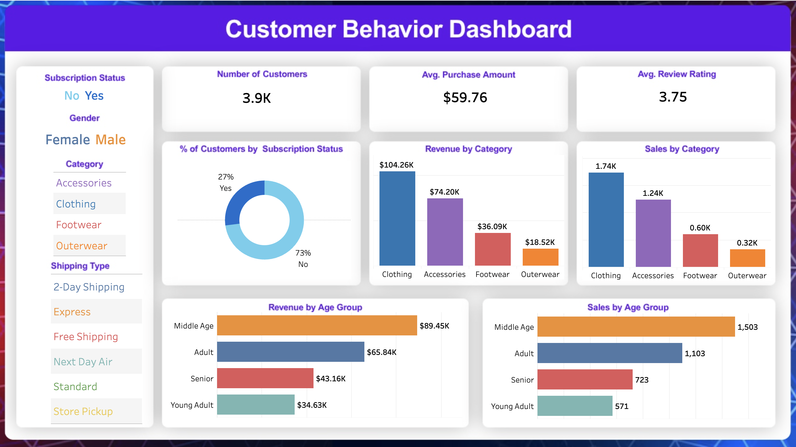

# 🛍️ Customer Shopping Behavior Analysis

An end-to-end Data Analytics project focused on uncovering deep insights from customer transactions. This project involves **Data Preprocessing**, **Exploratory Data Analysis (EDA)**, **MySQL Integration**, and an interactive **Tableau Dashboard** to visualize spending patterns and customer segments.


<p align="center">
  
</p>

---

## 🎯 Project Objectives

The primary goal is to transform raw shopping data into actionable business intelligence by:
* **Analyzing Purchase Patterns:** Identifying when and how customers shop.
* **Customer Segmentation:** Grouping customers by demographics and loyalty.
* **Product Performance:** Evaluating top-rated items and revenue drivers.
* **Impact Analysis:** Understanding how discounts and subscriptions influence spending.
* **Data Visualization:** Building an interactive dashboard for stakeholders.

---

## 🧠 Dataset Overview

The dataset consists of **3,900 transactions** with **18 features**, capturing a wide range of consumer behaviors.

* **Rows:** 3,900
* **Features:** Demographics (Age, Gender), Purchase Details (Item, Category, Amount), Behavioral Data (Frequency, Ratings), and Subscription Status.
* **Data Quality:** Handled 37 missing values in `review_rating` using category median imputation.

---

## 🛠️ Tools & Technologies

* **Language:** Python (Pandas, NumPy)
* **Visualization:** Matplotlib, Seaborn
* **Database:** MySQL Workbench (for structured storage and querying)
* **BI Tool:** Tableau (for interactive dashboarding)

---

## 🧹 Data Preparation & Engineering

1. **Cleaning:** Standardized column names to `snake_case` and handled null values.
2. **Feature Engineering:**
   * Created `age_group` (Young Adult, Adult, Middle-aged, Senior).
   * Mapped `purchase_frequency` to numerical day values.
3. **Database Integration:** Cleaned data was stored in **MySQL Workbench** for structured analysis.

---

## 📊 Interactive Dashboard (Tableau)

🔗 **View Live Dashboard:** [Click Here to View on Tableau Public](https://public.tableau.com/app/profile/mehedi.hasan2176/viz/CustomerBehavior_17749425147970/Dashboard1)

**Key Visualizations:**
* Revenue by Gender & Age Group.
* Subscription vs. Non-subscription analysis.
* Shipping type impact on average spend.
* Product ratings and discount influence on high-spending customers.

---

## 📈 Key Insights

* 💰 **Revenue:** Male customers generated higher total revenue than female customers.
* 🛍️ **Top Rated Products:** Gloves (3.86), Sandals (3.84), and Boots (3.82) lead in satisfaction.
* 🚚 **Shipping:** Express shipping shows slightly higher average purchase value.
* 👥 **Segments:** Out of 3,900 customers, **1,053 are Subscribers**. The majority fall into the **Loyal** segment.
* 🎯 **Demographics:** Middle-aged customers are the primary revenue contributors.
* 💸 **Discounts:** High dependency observed for Hats, Sneakers, Coats, Sweaters, and Pants.

---

## 📦 Installation & Setup

### 1️⃣ Clone the Repository
```bash
git clone https://github.com/your-username/customer-shopping-analysis.git
cd customer-shopping-analysis
```

### 2️⃣ Install Dependencies
```bash
pip install -r requirements.txt
```

### 3️⃣ Run the Notebook
Open the files in `notebooks/` to see the step-by-step cleaning and EDA process.

---

## 📂 Project Structure
```text
├── data/              # Raw and cleaned datasets
├── notebooks/         # Jupyter notebooks for EDA & Cleaning
├── scripts/           # Python scripts for automation
├── dashboard/         # Tableau files (.twb / .twbx)
├── images/            # Dashboard screenshots (e.g., dashboard.png)
└── README.md          # Project documentation
```

---

## 📌 Business Recommendations

1. **Retention:** Promote subscription benefits to increase retention among the non-subscriber majority.
2. **Loyalty:** Implement targeted loyalty programs for repeat customers.
3. **Marketing:** Focus campaigns on **Middle-aged** (high revenue) and **Young Adults** (offer-driven).
4. **Promotion:** Highlight top-rated products like Gloves and Sandals in marketing campaigns.

---

## 👤 Author
**Mehedi Hasan**
* 🔗 Kaggle: [https://www.kaggle.com/mehedi71](https://www.kaggle.com/mehedi71)
* 🔗 LinkedIn: [https://www.linkedin.com/in/mehedi-hasan-094855388/](https://www.linkedin.com/in/mehedi-hasan-094855388/)
* 🔗 Tableau Public: [https://public.tableau.com/app/profile/mehedi.hasan2176/vizzes](https://public.tableau.com/app/profile/mehedi.hasan2176/vizzes)
